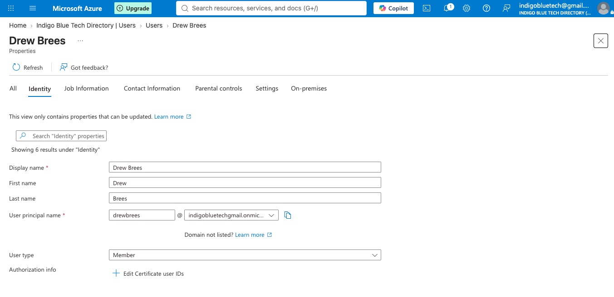

# 🧬 JML Identity Lifecycle Management Project (Joiner • Mover • Leaver)

**Platform:** Microsoft Entra ID  
**Focus:** Identity Lifecycle Management, Automation, ##Dynamic Groups, Enterprise App Access, Conditional Access##

💻

## 📘 Project Overview

This project showcases an implemented Joiner, Mover, Leaver (JML) lifecycle. 

In this project, I implemented a Joiner–Mover–Leaver (JML) model where **user attributes** automatically controlled:

- Group membership
- Application access
- Conditional Access enforcement
- Access revocation

All behavior was validated using group membership, jwt.ms token inspection, and sign-in logs.

